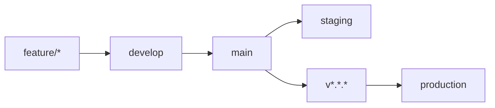

# CI/CD Pipeline Documentation

## 📋 Descripción General

Este proyecto utiliza GitHub Actions para implementar un pipeline de CI/CD completo que incluye:

- ✅ **Integración Continua (CI)**: Build, tests, análisis de calidad
- 🚀 **Despliegue Continuo (CD)**: Despliegue automático a staging y producción
- 🔐 **Seguridad**: Análisis de vulnerabilidades y dependencias
- 📦 **Gestión de dependencias**: Updates automáticos con Dependabot

## 🔄 Workflows Disponibles

### 1. CI Pipeline (`ci.yml`)
**Trigger**: Push/PR a `main`, `develop`, `feature/*`, `hotfix/*`

**Jobs**:
- **build-and-test**: Compilación, pruebas unitarias e integración
- **code-quality**: Análisis de calidad de código
- **docker-build**: Test de construcción de imagen Docker

**Características**:
- Cache de NuGet packages
- MongoDB de prueba con Docker
- Cobertura de código con ReportGenerator
- Upload a Codecov

### 2. CD Pipeline (`cd.yml`)
**Trigger**: Push a `main`, tags `v*`, workflow manual

**Jobs**:
- **build-and-push**: Construcción y push de imagen Docker a GHCR
- **deploy-staging**: Despliegue automático a staging (main branch)
- **deploy-production**: Despliegue a producción (tags v* o manual)

**Características**:
- Multi-platform Docker builds (amd64, arm64)
- Environments con protección
- Smoke tests post-deployment
- Notificaciones de despliegue

### 3. Release Pipeline (`release.yml`)
**Trigger**: Tags `v*`, workflow manual

**Jobs**:
- **create-release**: Generación automática de releases
- **trigger-deployment**: Activación de despliegue a producción

**Características**:
- Changelog automático desde commits
- Paquetes de release
- Trigger automático de CD

### 4. Security Scan (`security.yml`)
**Trigger**: Push/PR, programado diario, manual

**Jobs**:
- **codeql-analyze**: Análisis estático con CodeQL
- **dependency-scan**: Escaneo de vulnerabilidades en dependencias
- **docker-security-scan**: Análisis de imagen Docker con Trivy

### 5. Dependency Updates (`dependencies.yml`)
**Trigger**: Programado semanal, manual

**Jobs**:
- **update-dependencies**: Actualización automática de NuGet packages
- Creación de PR automático para revisión

## 🔧 Configuración Requerida

### Secrets de GitHub

#### Para CI/CD general:
```
GITHUB_TOKEN (automático)
```

#### Para despliegue Azure:
```
AZURE_CREDENTIALS_STAGING
AZURE_CREDENTIALS_PRODUCTION
ACR_NAME
AZURE_RG_STAGING
AZURE_RG_PRODUCTION
MONGODB_CONNECTION_STRING_STAGING
MONGODB_CONNECTION_STRING_PRODUCTION
```

#### Para coverage (opcional):
```
CODECOV_TOKEN
```

### Environments

Crear environments en GitHub:
- `staging`: Para despliegues de desarrollo
- `production`: Para despliegues de producción (con revisores)

### Variables de entorno por environment:

**Staging**:
```
ASPNETCORE_ENVIRONMENT=Staging
MongoDb__DatabaseName=VetUberApp_Staging
```

**Production**:
```
ASPNETCORE_ENVIRONMENT=Production
MongoDb__DatabaseName=VetUberApp_Production
```

## 🚀 Flujo de Desarrollo

### Ramas y Despliegues



1. **Feature branches** → `develop`: CI completo
2. **develop** → `main`: CI + preparación para staging
3. **main**: Despliegue automático a **staging**
4. **Tags v***: Despliegue a **production**

### Proceso de Release

1. Crear tag: `git tag v1.0.0 && git push origin v1.0.0`
2. GitHub Actions crea release automáticamente
3. Se despliega a producción
4. Se genera changelog y documentación

## 📊 Monitoreo y Reportes

### Cobertura de Código
- Reports generados con cada CI
- Upload automático a Codecov
- Threshold configurable

### Análisis de Seguridad
- CodeQL análisis estático
- Dependabot para actualizaciones
- Trivy para análisis de imágenes Docker
- Reports en Security tab de GitHub

### Quality Gates
- ✅ Build exitoso
- ✅ Todas las pruebas pasan
- ✅ Cobertura > umbral
- ✅ Sin vulnerabilidades críticas
- ✅ Docker build exitoso

## 🛠️ Comandos Útiles

### Testing local del Docker build:
```bash
docker build -t vetuberapp:local .
docker run -p 8080:8080 vetuberapp:local
```

### Trigger manual de workflows:
```bash
# Trigger CD
gh workflow run cd.yml -f environment=staging

# Trigger security scan
gh workflow run security.yml
```

### Creación de release:
```bash
git tag v1.0.0
git push origin v1.0.0
```

## 🔍 Troubleshooting

### Build failures
1. Verificar dependencias en `*.csproj`
2. Revisar MongoDB connection string
3. Verificar cache de NuGet

### Deployment failures
1. Verificar secrets de Azure
2. Revisar permisos de container registry
3. Verificar health checks

### Security scan failures
1. Revisar dependencias obsoletas
2. Actualizar imagen base de Docker
3. Revisar reportes de Trivy

## 📚 Referencias

- [GitHub Actions Documentation](https://docs.github.com/en/actions)
- [Docker Best Practices](https://docs.docker.com/develop/dev-best-practices/)
- [Azure Container Apps](https://docs.microsoft.com/en-us/azure/container-apps/)
- [Dependabot Configuration](https://docs.github.com/en/code-security/dependabot)